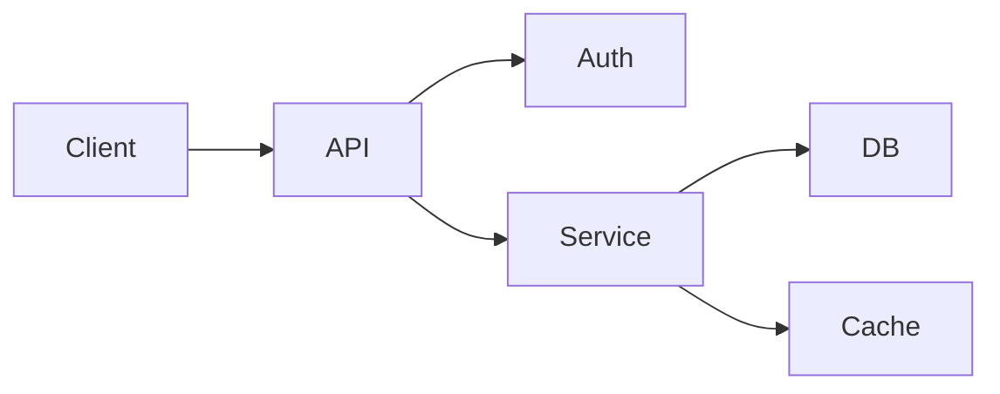
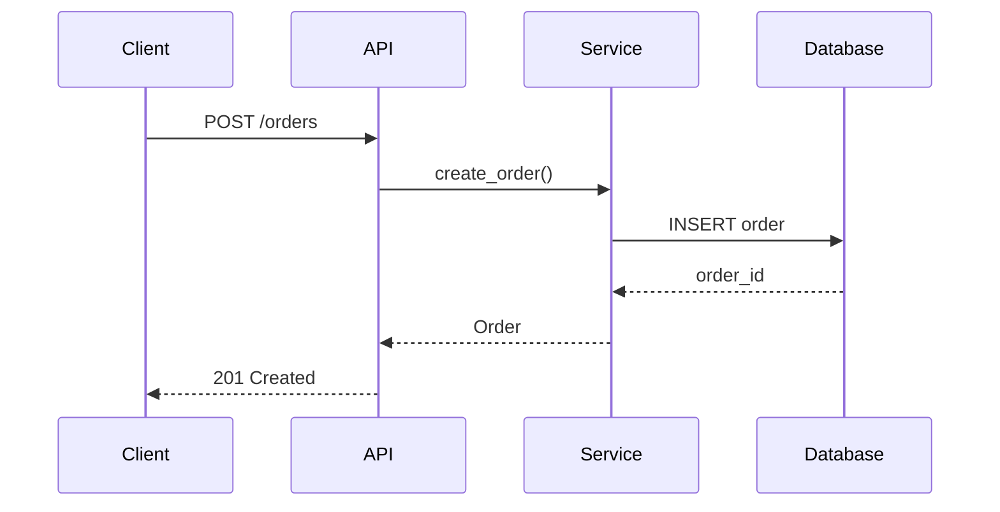

# Architecture Mode

High-level design and system understanding.

## Scope Mantra

> "Interfaces in; interfaces out. Data in; data out. Major flows, contracts, behaviors, and failure modes only."

## What to Focus On

✅ **Include**:

- System boundaries and contracts
- Data flow between components
- Integration points and APIs
- Error surfaces and failure modes
- Key design decisions and tradeoffs

❌ **Skip**:

- Implementation details
- Line-by-line code analysis
- Minor utility functions
- Specific algorithms (unless architecturally significant)

## Analysis Framework

### 1. Component Identification

- What are the major components/modules?
- What is each component's single responsibility?
- How are they organized (layers, services, etc.)?

### 2. Interface Analysis

- What are the public APIs?
- What data structures cross boundaries?
- What are the contracts between components?

### 3. Data Flow

- How does data enter the system?
- How does it transform as it moves?
- Where is state stored?

### 4. Integration Points

- What external systems are connected?
- What protocols/formats are used?
- What are the failure modes?

### 5. Quality Attributes

- How is reliability achieved?
- How does it scale?
- What security measures exist?

## Architecture Overview Format

```markdown
## Architecture Overview

### Purpose

[What this system does in 1-2 sentences]

### Components

| Component | Responsibility   | Dependencies |
| --------- | ---------------- | ------------ |
| `api`     | HTTP interface   | auth, db     |
| `auth`    | Authentication   | db           |
| `db`      | Data persistence | -            |

### Data Flow

[Mermaid diagram - see below]

### Key Decisions

| Decision | Rationale | Tradeoffs   |
| -------- | --------- | ----------- |
| [choice] | [why]     | [pros/cons] |
```

## Mermaid Diagrams

### Component Diagram



### Sequence Diagram



## API Contract Format

````markdown
## API: /orders

### POST /orders

Create a new order.

**Request**:

```json
{
  "items": [{ "sku": "ABC", "qty": 2 }],
  "customer_id": "cust_123"
}
```
````

**Response** (201):

```json
{
  "order_id": "ord_456",
  "status": "pending",
  "total": 49.99
}
```

**Errors**:

- `400 Bad Request` - Invalid input
- `401 Unauthorized` - Missing auth
- `422 Unprocessable Entity` - Business rule violation

```

## Guidelines

- Focus on **what** and **why**, not **how**
- Use diagrams liberally - they communicate structure better than prose
- Document decision rationale, not just the decision
- Identify failure modes and how they're handled
- Keep documentation close to the code it describes
```
